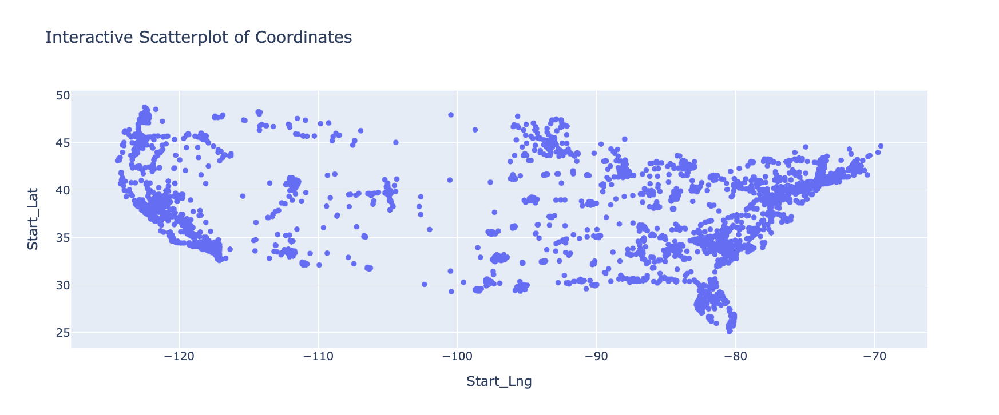
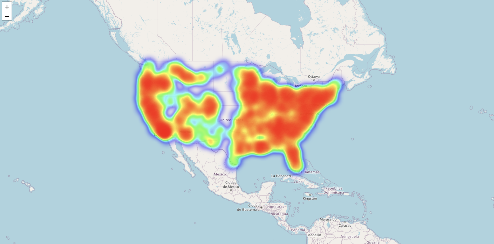
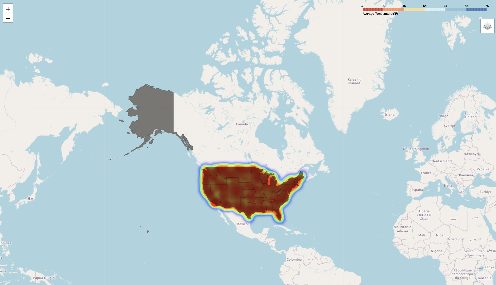
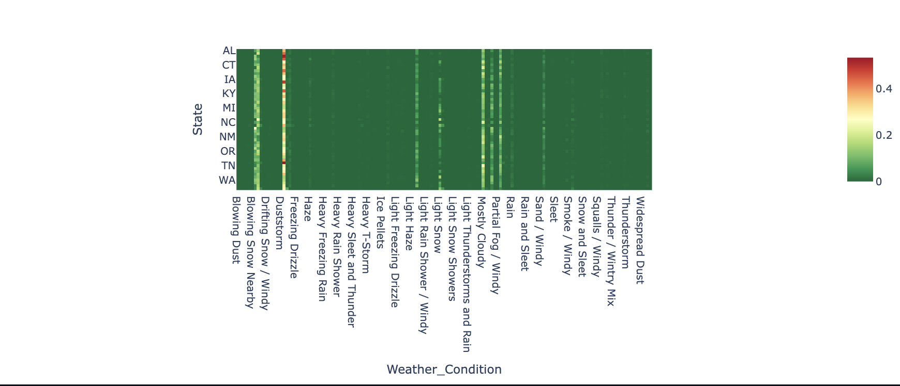
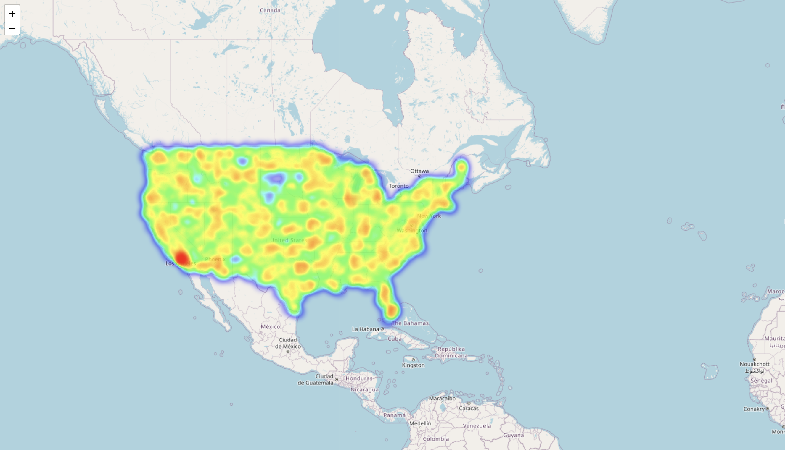

# 🚗 US Accidents Exploratory Data Analysis

This project contains an end-to-end Exploratory Data Analysis (EDA) of over **7 million road accident records** from across the United States. It aims to uncover trends and patterns related to **accident time, severity, weather, visibility, and geography**, and provide useful insights that can support **road safety planning and policymaking**.

---

## 📁 Dataset Information

- 📦 **Source**: [Kaggle - US Accidents Dataset](https://www.kaggle.com/datasets/sobhanmoosavi/us-accidents)
- 🧾 **Records**: ~7.8 million accident cases
- 📍 **Coverage**: 49 U.S. states (excluding New York)
- 📅 **Years Covered**: 2016 to early 2023
- 📚 **Features**: Location, time, severity, temperature, weather, visibility, and more

---

## 🎯 Project Objectives

- ⏰ Identify accident patterns by **hour, day, and month**
- 🌐 Explore accident distribution across **states and cities**
- 🌦️ Assess environmental effects like **weather, temperature, and visibility**
- ⚠️ Analyze **severity levels** and when they occur
- 📊 Provide visual insights for data-driven safety interventions

---

## 🛠️ Tools & Libraries Used

- `Python 3.9`
- `pandas`, `numpy`
- `matplotlib`, `seaborn`
- `plotly`, `folium`
- `ydata-profiling` (formerly pandas-profiling)
- `Jupyter Notebook`

---

## 📈 Key Insights

- 🕓 Most accidents happen during **commute hours**: 6–10 AM & 3–6 PM
- 📅 **Fridays** and weekdays in general show higher accident frequency
- ❄️ **December** has the highest monthly accident count
- 🌤️ Surprisingly, most accidents happen under **fair weather and good visibility**
- 🌡️ Temperature range with most accidents: **25°F–85°F**, peaking near **77°F**
- ❄️ **Severe accidents** are more likely in **snow or low visibility** conditions
- 👥 **Human behavior and traffic volume** appear more predictive than weather alone

---

## 📊 Visual Insights

### 📊 Sample Distribution of Accidents

### 🔥 Overall Accident Location Density

### 🌡️ Accident Locations by Temperature

### ⚙️ Weather Conditions with Most Accidents (by State)

### 👁️ Visibility at the Time of Accidents

---

## 📌 File Structure

#### ├── Exploratory_Data_Analysis_US_Accidents_final-2.ipynb # Main analysis notebook
#### ├── environment.yml # Conda environment for reproducibility
#### ├── README.md # This file
#### ├── /images # Folder to store visualizations/screenshots
